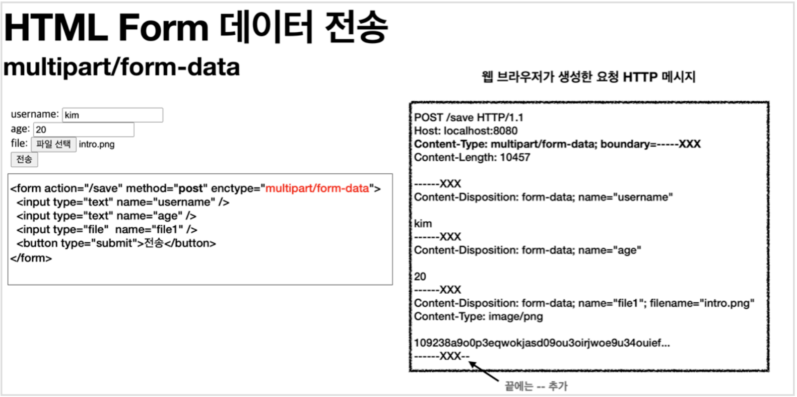

# 김영한님 스프링 MVC 스터디

- [서블릿](https://github.com/give928/study-spring-servlet)
- [타임리프](https://github.com/give928/study-spring-mvc-thymeleaf)
- [아이템 서비스](https://github.com/give928/study-spring-mvc-item-service)
- [메시지, 국제화](https://github.com/give928/study-spring-mvc-message)
- [검증](https://github.com/give928/study-spring-mvc-validation)
- [로그인, 필터, 스프링 인터셉터](https://github.com/give928/study-spring-mvc-login)
- [예외 처리와 오류 페이지](https://github.com/give928/study-spring-mvc-exception)
- [스프링 타입 컨버터](https://github.com/give928/study-spring-mvc-typeconverter)
- [파일 업로드](https://github.com/give928/study-spring-mvc-upload)

## 파일 업로드

파일을 업로드 하려면 파일은 문자가 아니라 바이너리 데이터를 전송해야 한다.

application/x-www-form-urlencoded 방식은 HTML 폼 데이터를 서버로 전송하는 가장 기본적인
방법이다. Form 태그에 별도의 enctype 옵션이 없으면 웹 브라우저는 요청 HTTP 메시지의 헤더에 다음 내용을 추가한다.
Content-Type: application/x-www-form-urlencoded
그리고 폼에 입력한 전송할 항목을 HTTP Body에 문자로 username=kim&age=20 와 같이 & 로 구분해서 전송한다.

**문자와 바이너리를 동시에 전송**해야 하는 상황이다.

이 문제를 해결하기 위해 HTTP는 multipart/form-data 라는 전송 방식을 제공한다.



이 방식을 사용하려면 Form 태그에 별도의 enctype="multipart/form-data" 를 지정해야 한다.

**업로드 사이즈 제한**

```
  spring.servlet.multipart.max-file-size=1MB
  spring.servlet.multipart.max-request-size=10MB
```

사이즈를 넘으면 예외( SizeLimitExceededException )가 발생한다. max-file-size : 파일 하나의 최대 사이즈, 기본 1MB

max-request-size : 멀티파트 요청 하나에 여러 파일을 업로드 할 수 있는데, 그 전체 합이다. 기본 10MB

**spring.servlet.multipart.enabled 끄기**

```
spring.servlet.multipart.enabled=false
```

@RequestParam MultipartFile file
업로드하는 HTML Form의 name에 맞추어 @RequestParam 을 적용하면 된다. 추가로 @ModelAttribute 에서도 MultipartFile 을 동일하게 사용할 수 있다.

**MultipartFile 주요 메서드**
file.getOriginalFilename() : 업로드 파일 명
file.transferTo(...) : 파일 저장
